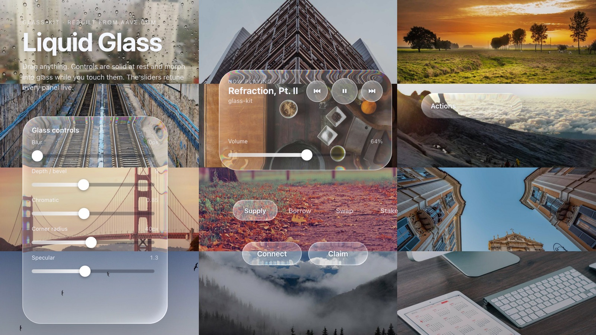

# refract

**Apple-style liquid glass for the web, as a React kit. The kind that actually bends the content behind it, not just a frosted blur.**

[**Live demo →**](https://etm-code.github.io/refract/) · drag everything, the sliders retune the glass in real time.



---

## Why this exists

I saw [Aave's "Building Glass for the Web"](https://aave.com/design/building-glass-for-the-web) and went "right, I want that." Their glass doesn't fake it. It refracts the real, live HTML sitting behind it, bending light around the edges the way actual curved glass does. It's lovely.

Then I went looking for the code. There isn't any. Aave wrote a gorgeous article about how they did it and shipped exactly zero of it. No repo, no package, nothing. A write-up and a wave goodbye.

So I pulled their site apart, read how the effect was actually built, and rebuilt it from scratch as something you can use. Not a single glass `<div>` either. a proper kit: buttons, sliders, a switch, a segmented control, a morph-out menu, all with the liquid behaviour where a control sits there solid and then turns to glass under your finger.

Basically: I wanted the nice thing, the nice thing wasn't for sale, so here's the nice thing.

## Install

It's not on npm yet. For now, clone it or copy the kit straight in.

```bash
git clone https://github.com/ETM-Code/refract
cd refract
bun install      # or npm install
bun run dev      # play with the demo locally
```

To drop it into your own app, copy `src/glass-kit/` across. You need React 18+ and `framer-motion`:

```bash
bun add framer-motion
```

```tsx
import { Glass, GlassButton, GlassSlider } from "./glass-kit";

function Card() {
  const [vol, setVol] = useState(50);
  return (
    <Glass width={320} height={180} borderRadius={28}>
      <GlassSlider label="Volume" value={vol} min={0} max={100} onChange={setVol} />
      <GlassButton onClick={connect}>Connect</GlassButton>
    </Glass>
  );
}
```

Importing from the kit pulls in its stylesheet automatically. Put rich, colourful content behind the glass (photos, gradients, anything), because glass with nothing behind it is just a window.

## What's in the box

| Component | What it does |
|---|---|
| `Glass` | The core lens. Refracts whatever's painted behind it. Every other piece is built on this. |
| `GlassPanel` | A `Glass` card with sensible padding. Use it as a container. |
| `GlassButton` | Solid frosted pill at rest, morphs to clear glass while pressed. |
| `GlassSlider` | Real grabbable thumb that grows and turns to glass on grab, and stretches with your drag speed. Fill bar is genuinely zero at minimum. |
| `GlassSwitch` | Knob that morphs to glass and squashes as it springs across. |
| `GlassSegmented` | Tabs with a glass selector that springs between them, and you can grab and slide it like a dial. |
| `GlassMenu` | The Apple one. The trigger springs *open* into the menu, options stagger up, rather than just appearing. |
| `Draggable` | Helper so you can throw any of the above around the page. |

There are hooks too (`useDraggable`, `useMorphActive`) and the raw displacement-map engine (`generateDisplacementMap`) if you want to build your own pieces.

## How it works

One SVG primitive does the heavy lifting: `feDisplacementMap`, applied through `backdrop-filter` so it warps the live page content behind the element rather than a screenshot of it. On engines that can't run an SVG filter through `backdrop-filter` (Safari, Firefox) the kit detects that at runtime and renders a frosted-glass fallback instead — see [Browser support](#browser-support).

The trick is the displacement map. The kit draws one procedurally on a `<canvas>`: a signed-distance rounded rectangle where the red and green channels encode the surface normal (which way each pixel pushes the light) and the blue channel carries a specular highlight. Feed that into the SVG filter, run the displacement three times for a touch of chromatic aberration on the edges, and you get glass that bevels light at its rim. The maths for that map is ported from Aave's own bundle. credit where it's due, it's their geometry, I just made it legible and reusable.

The interaction rule running through the whole kit: **solid at rest, glass on touch.** A button looks like a normal frosted button until you press it, then the skin fades and the lens underneath takes over. Same with the slider thumb, the switch, the tab selector. The glass is the feedback, not the default state.

## What it can and can't do

I'd rather tell you the limits up front than have you find them.

**It can:**
- Refract live, real content behind it. Move it, scroll the page, change what's underneath, and the refraction updates. No `html2canvas` snapshotting.
- Run the morph and spring animations smoothly while you drag, because the expensive bit (baking the displacement map) only happens on resize, not on every frame.
- Be themed with a handful of CSS variables (`--gk-accent`, `--gk-fill`, and friends).
- Take a beating from your pointer. drag, slide, toggle, all on pointer events, so it works with touch too.

**It can't (yet), or won't do well:**
- **True refraction is Chromium-only; the rest get a real frosted fallback.** See [Browser support](#browser-support) for the full story. Short version: Chromium refracts; Safari and Firefox now get a proper frosted-blur-plus-lit-rim fallback (not the old flat tint), chosen automatically.
- **It's not a hundreds-of-instances effect.** Each glass surface is its own SVG filter and its own backdrop pass. Grand for a UI's worth of controls, not for tiling 200 of them. it's GPU work. Off-screen lenses pause their backdrop pass automatically (IntersectionObserver), and identical lenses share one baked displacement map, so a normal UI's worth is comfortable.
- **Heavy blur muddies it.** Blur defaults to 0 on purpose. The refraction is the point; crank the blur and you bury it. There's a slider in the demo so you can see exactly where it stops looking good.
- **It's not on npm and it's not "done."** No published package, no test suite, no Safari-first path. It's a working kit and an honest starting point, not a 1.0.
- **It won't bend a live video at zero cost.** A video behind the glass *does* refract in Chromium, but per-frame backdrop work on video is exactly where this approach gets expensive. Aave used a dedicated WebGL pass for their video player for that reason, and I haven't rebuilt that part here.

## Browser support

| Engine | What you get |
|---|---|
| **Chromium** (Chrome, Edge, Arc, Brave) | Full live refraction. `feDisplacementMap` runs through `backdrop-filter` against the real content behind the lens. |
| **Safari / WebKit** (incl. all iOS browsers) | Frosted-glass fallback: a real `backdrop-filter: blur()` plus a baked specular/edge rim, so it reads as lit glass — not the flat tint earlier versions left behind. No live refraction (see below). |
| **Firefox** | Same frosted fallback as Safari. |

**Why Safari can't refract.** WebKit parses `backdrop-filter: url(#svg-filter)` — `getComputedStyle` even echoes it back — but never runs the SVG filter against the backdrop, so you get nothing. There's no media query for this, so the kit detects the engine at runtime ([`supportsBackdropDisplacement()`](src/glass-kit/support.ts)) and renders the fallback automatically. WebKit *does* run an SVG filter applied as a regular `filter:` (not `backdrop-filter:`), which is why the `sample` escape hatch below works there: it filters a live DOM copy. Doing that for an arbitrary backdrop would mean snapshotting the page (`html2canvas`) or a WebGL pass, neither of which this kit does on principle.

**The `sample` escape hatch.** If you control the content behind a lens, pass it (and its size/offset) via the `sample` props. The kit filters that copy with the same displacement chain through a regular `filter:`, which Safari *will* run — giving real refraction in WebKit for that specific case. The Safari filter-id caching bug (it caches filter output by id and freezes on a stale map) is handled: every bake gets a fresh id.

### Performance

The expensive part — baking the displacement map — runs only when a lens's parameters change, never per frame and never on scroll. On top of that:

- **Identical lenses share one baked map** (`getDisplacementMap` memoises across instances), so a panel full of same-spec thumbs and buttons bakes once, not N times.
- **Bake resolution is capped to the on-screen size** (`resolveMapSize`): a 24px slider thumb no longer bakes a 512² map.
- **Off-screen lenses drop their backdrop pass** to `none` via IntersectionObserver, so a long page doesn't keep paying for filters you can't see.

Rough frame times on the demo (27-photo backdrop, 18 live lenses, 1440×900 @2×, Playwright):

| | idle | while scrolling |
|---|---|---|
| Chromium, before | ~17 ms (60 fps) | ~300 ms/frame |
| Chromium, after | ~17 ms (60 fps) | ~180–200 ms/frame |
| Safari, after | ~17 ms (60 fps) | ~17 ms (fallback is cheap) |

Scrolling a wall of live Chromium backdrop-filters over full-res photos is still GPU-bound — that's inherent to refracting live content, not a bug. The kit-level work above keeps a normal UI's worth of controls smooth; tiling hundreds of lenses over a heavy backdrop will still cost you.

## How it compares

There's a small pile of "liquid glass for the web" repos now. Most of them appeared after Apple showed Liquid Glass at WWDC. They split roughly into two camps: the CSS + SVG ones (portable, lighter, Chromium-leaning) and the WebGL/WebGPU ones (more physically faithful, heavier, fussier to set up). Here's the honest lay of the land.

| Project | Technique | React kit of controls? | Notes |
|---|---|---|---|
| **refract** (this) | CSS `backdrop-filter` + SVG `feDisplacementMap` over live DOM | **Yes** | The whole point is the components and the morph-on-touch behaviour, not just one glass panel. Chromium refracts; Safari/Firefox get an automatic frosted fallback. |
| [shuding/liquid-glass](https://github.com/shuding/liquid-glass) | Same CSS + SVG displacement approach | No | Brilliant, tiny, copy-paste-into-the-console primitive. A single glass surface, not a component set. Closest cousin technically. |
| [nikdelvin/liquid-glass](https://github.com/nikdelvin/liquid-glass) | CSS + SVG (displacement, blur, colour matrix) | No (Astro/Tailwind) | Pixel-chasing an iOS 26 look. Falls back to plain glassmorphism on Safari, same wall I hit. |
| [AndrewPrifer/liquid-dom](https://github.com/AndrewPrifer/liquid-dom) | WebGPU, renders live DOM into GPU textures | Partly (React/Three bindings) | The most advanced of the lot and the least portable. needs WebGPU and a Chrome experimental flag on. |
| [naughtyduk/liquidGL](https://github.com/naughtyduk/liquidGL) | WebGL shader + `html2canvas` snapshots | No (vanilla) | Genuinely refracts, video included, but works off snapshots, so live CSS animations behind it don't update in real time. |
| [dashersw/liquid-glass-js](https://github.com/dashersw/liquid-glass-js) | WebGL 2.0 shaders + `html2canvas` | Wrappers on the roadmap | Multi-layer refraction, more physically involved, still early (npm package and TS rewrite pending). |
| [Specy/liquid-glass](https://github.com/Specy/liquid-glass) | Three.js material (transmission, IOR, dispersion) | Yes (React) | Proper physical-glass material. Gorgeous, but Three.js init is the cost you pay. |

Where this one sits: if you want **ready-made React controls** with the Apple morph feel and you're shipping to a Chromium-heavy audience, this is for you. If you need bulletproof Safari support or you're refracting live video, one of the WebGL options will serve you better. And if you just want the bare glass surface to paste in, [shuding's](https://github.com/shuding/liquid-glass) is the leanest thing going.

To be clear: none of these, including this one, is Aave's actual code. Theirs is still shut. This is a clean-room rebuild of the *idea*, with the displacement geometry read from their public bundle and rewritten to be readable.

## Credits

- The effect, the article, and the displacement-map geometry: [Aave](https://aave.com/design/building-glass-for-the-web). They didn't ship it, but they explained it beautifully.
- Springs and motion: [framer-motion](https://www.framer.com/motion/).
- Built by [ETM-Code](https://github.com/ETM-Code).

## License

[MIT](./LICENSE). Take it, use it, build something nice.
